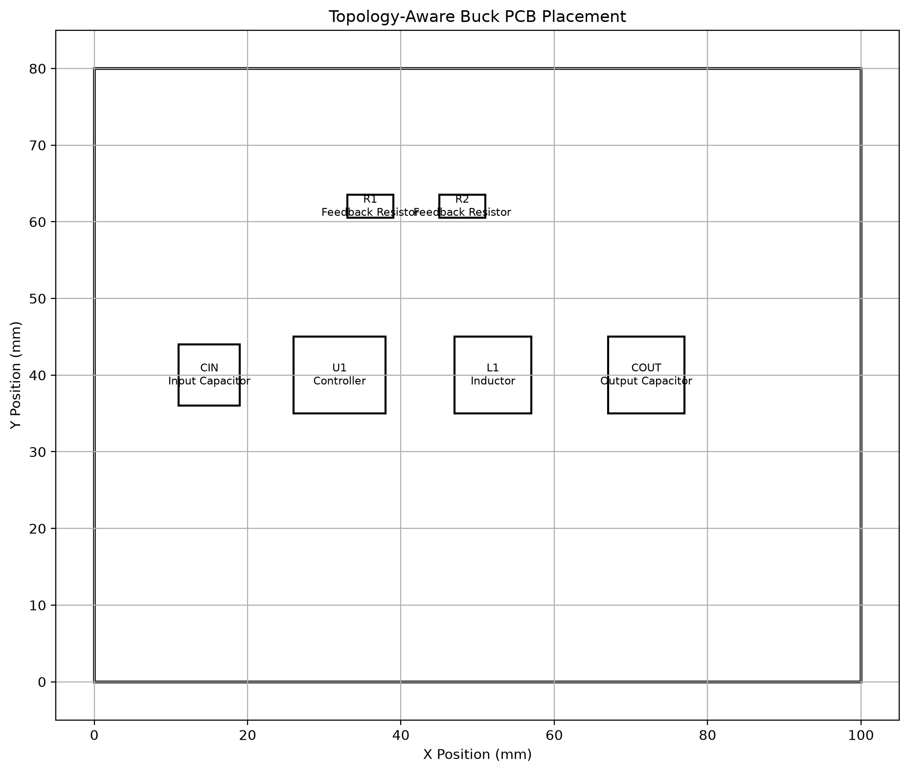

# LLM-PCB

## 1. Project Goal

This project proposes an LLM-assisted PCB automatic design
framework capable of generating PCB schematics, placement,
routing, and EDA outputs from high-level design
requirements.

---

## 2. System Architecture

The proposed framework consists of six major stages:

1. Requirement Analysis
2. Constraint Graph Construction
3. Knowledge Graph Enrichment
4. Schematic Graph Generation
5. Placement and Routing
6. EDA Export

---

## 3. Constraint Graph

The user requirements are transformed into a constraint
graph describing electrical specifications, topology,
required components, routing constraints, and placement
constraints.

The graph representation separates design reasoning from
physical implementation.

---

## 3.1 Knowledge Enrichment

Topology knowledge, PCB design rules, and candidate
components are injected into the constraint graph.

The enriched graph becomes the reasoning backbone of the
whole framework.

---

## 3.2 Rule Injection

Placement rules and routing rules are represented as graph
nodes.

The graph explicitly models the relationship between
topology, required components, placement constraints, and
routing constraints.

---

## 3.3 Candidate Component Selection

Candidate controllers are selected according to electrical
requirements and ranked according to efficiency and design
priority.

---

## 3.4 Schematic Graph Generation

The proposed framework converts the knowledge-aware
constraint graph into a pin-level schematic graph.

The schematic graph contains three types of nodes:

- Components
- Pins
- Nets

A component is connected to its pins through has_pin
relationships, while every electrical pin is connected to
a net through connected_to relationships.

---

## 3.5 EDA-Neutral Intermediate Representation

The schematic graph is serialized into an EDA-neutral JSON
representation.

The representation records

- metadata
- components
- pins
- nets
- statistics

This intermediate format allows exporting to Altium,
KiCad, or future PCB design tools without changing the
reasoning engine.

---

## 3.6 Topology-Aware PCB Placement

The initial PCB placement is generated using topology-aware
design rules rather than random or purely geometric
placement.

For a Buck converter, the major power-stage components are
placed according to the expected energy-flow direction:
input capacitor, controller, inductor, and output
capacitor. The feedback network is assigned to a separate
region away from the switching path.

The placement engine retrieves structured placement rules
from the knowledge-aware constraint graph and associates
the applied rules with individual placed components.

A lightweight rule validator evaluates critical component
distances, including the input-capacitor-to-controller
distance, controller-to-inductor distance, and feedback
network separation from the switching region.

---

### Placement Representation and Visualization

The placement result is represented using an
EDA-neutral JSON structure containing board dimensions,
component coordinates, rotations, component dimensions,
and rule-related attributes.

A placement visualization module renders the board
boundary and placed component bounding boxes. This
visualization supports qualitative inspection of the
topology-aware placement results and provides figures for
experimental evaluation.

The implementation also includes boundary validation and
axis-aligned component-overlap detection. These checks
ensure that the generated initial placement is
geometrically valid before routing begins.

---

## 3.7 Constraint-Aware Routing Planning

The routing planner converts schematic connectivity,
placement coordinates, and topology-specific routing
constraints into a structured routing plan.

Each net is assigned a routing priority, preferred trace
width, preferred layer, routing strategy, and avoidance
constraints. Critical switching and high-current power
nets are assigned higher routing priority than sensitive
feedback and ground connections.

The planner selects an initial orthogonal-routing strategy
according to the horizontal and vertical span of the net
endpoints. The resulting routing plan is stored in an
EDA-neutral JSON representation and serves as the input
to the subsequent geometry-routing stage.

## 3.8 Manhattan Geometry Routing

The structured routing plan is converted into explicit
geometry using a Manhattan routing engine. Each connection
is represented as a sequence of axis-aligned route points
and horizontal or vertical trace segments.

For a two-terminal connection, the router selects either a
horizontal-first or vertical-first strategy according to
the routing plan. Multi-terminal nets are initially routed
using a star topology in which the first endpoint is
connected individually to the remaining endpoints.

The implementation preserves the net-specific routing
priority, preferred trace width, and preferred layer
generated during constraint-aware routing planning. The
result is serialized into an EDA-neutral routing JSON
representation and rendered together with the component
placement.

## 3.9 Geometry-Based Obstacle Detection

PCB components are represented as axis-aligned rectangular
obstacles derived from their placement coordinates and
component dimensions.

The obstacle-detection module evaluates horizontal and
vertical routing segments against expanded component
boundaries. The expansion incorporates both component
clearance and half of the routing-trace width, allowing
the collision model to approximate physical spacing
requirements.

Source and target components may be excluded from collision
checking because the corresponding route is expected to
terminate at their pads. The resulting collision-detection
interface is reused by subsequent detour generation and
search-based routing algorithms.

## 4. Current Progress

✔ SQLite Component Database

✔ JSON Knowledge Base

✔ Constraint Graph

✔ Knowledge Enrichment

✔ Rule Engine

✔ Candidate Selection

✔ Circuit Graph

✔ JSON Export

---

## Next Step

Topology-aware PCB Placement Engine